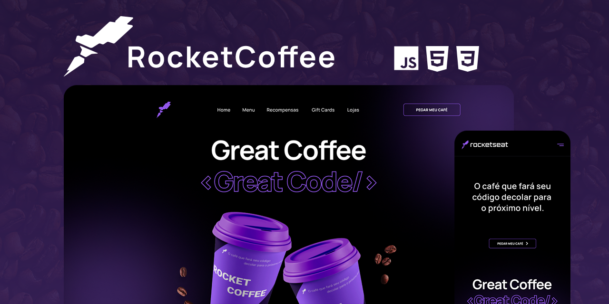

<div align="center" id="top"> 
  

&#xa0;

<a href="https://td-greate-coffee.surge.sh">Demo</a>

</div>

<h1 align="center">Great Coffe</h1>

<p align="center">
  

  

  

  

  <!--  -->

  <!--  -->

  <!--  -->
</p>

<!-- Status -->

<!-- <h4 align="center">
	🚧  Great Coffe 🚀 Em construção...  🚧
</h4>

<hr> -->

<p align="center">
  <a href="https://www.figma.com/file/tFoovGllUttTebdUTDVdT8/RocketCoffee/duplicate">Layout</a> &#xa0; | &#xa0;
  <a href="#dart-sobre">Sobre</a> &#xa0; | &#xa0; 
  <a href="#rocket-tecnologias">Tecnologias</a> &#xa0; | &#xa0;
  <a href="#white_check_mark-pré-requisitos">Pré requisitos</a> &#xa0; | &#xa0;
  <a href="#checkered_flag-começando">Começando</a> &#xa0; | &#xa0;
  <a href="#memo-licença">Licença</a> &#xa0; | &#xa0;
  <a href="https://github.com/thiilins" target="_blank">Autor</a>
</p>

<br>

## :dart: Sobre

Neste desafio você deverá desenvolver uma homepage para uma marca de café.

## :sparkles: Requisitos

- Seguir o layout do Figma.
- Deixar o layout responsivo conforme o Figma.
- Na versão mobile, ao clicar no menu hamburger deverá exibir um menu responsivo conforme layout do Figma.
- Adicionar `hover` nos botões.

## :rocket: Tecnologias

As seguintes ferramentas foram usadas na construção do projeto:

- HTML
- CSS
- Javascript

## :white_check_mark: Pré requisitos

Antes de começar :checkered_flag:, você precisa ter o [Git](https://git-scm.com) e o [Node](https://nodejs.org/en/) instalados em sua maquina.

## :checkered_flag: Começando

```bash
# Clone este repositório
$ git clone https://github.com/thiilins/great-coffe

# Entre na pasta
$ cd great-coffe

# Inicie via Live Server
# O app vai inicializar em <http://localhost:5050>
```

## :memo: Licença

Este projeto está sob licença MIT. Veja o arquivo [LICENSE](LICENSE.md) para mais detalhes.

Feito com :heart: por <a href="https://github.com/thiilins" target="_blank">Thiago Lins</a>

&#xa0;

<a href="#top">Voltar para o topo</a>
